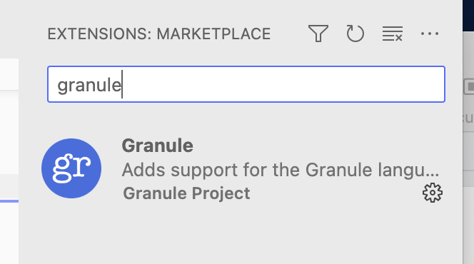

SPLV'23 Material
------------------------------

### Getting Granule

You have a few options:

* __Local install__:  The latest release is [v0.9.4.0](https://github.com/granule-project/granule/releases). There are binaries for Mac OSX (arm64) and Linux, and you will also need to [install Z3](https://github.com/Z3Prover/z3). [However, you may need to build yourself if your platform isn't provided for](https://github.com/granule-project/granule/blob/main/README.md#installation).

* __Docker__: Official Docker image of v0.9.4.0. The following command puts you into `grepl` with the local directory mounted as `/host`

       docker run -v $(pwd):/host --interactive docker.io/raehik/granule-repl:dev-minor

* __Online (old version)__: There is an [online version](https://tio.run/#granule) although it is running an older version of Granule and won't work for all examples.

### Materials

* [Library documentation](https://granule-project.github.io/docs)
* [Exercises](https://granule-project.github.io/splv23-exercises.pdf)
* Slides
  * [Part 1 - Theory and practice of linear types](https://granule-project.github.io/splv23-slides-part1.pdf)
  * [Part 2 - Extending from linear types to graded types](https://granule-project.github.io/splv23-slides-part2.pdf)
  * [Code demos from Parts 1 & 2](splv23-tue.gr)
  * [Part 3 - Communication, uniqueness, and mutation](https://granule-project.github.io/splv23-slides-part3.pdf)
  * Part 4 - Grades in the wild via "graded base" and graded monads - Slide to come

### Granule Language Server and VSCode Extension

There is an extension for VSCode that you can get in the usual way from
inside VSCode:

This uses the [Granule Language Server (grls)](https://github.com/granule-project/granule/tree/main/server) if you want to get support in any other editor that support the LSP.

Additional key bindings in vscode:

* `Ctrl-e Ctrl-e`: attempts to synthesis a goal in a hole (written either `?` or `{! !}`.
* `Ctrl-e Ctrl-h`: attempts to rewrite the non-empty hole under the cursor (if there is one)
* `Ctrl-e Ctrl-u`: converts ASCII characters to their Unicode equivalents in the whole file.
* `Ctrl-e Ctrl-a`: converts Unicode characters to their ASCII equivalents in the whole file.
